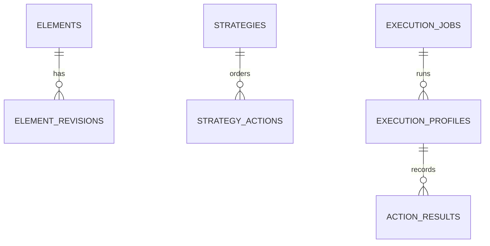
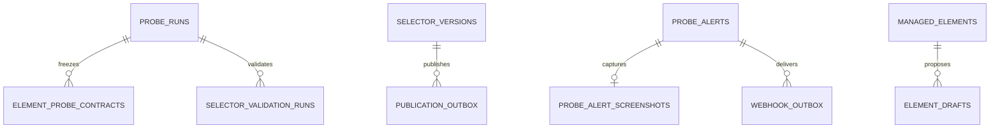
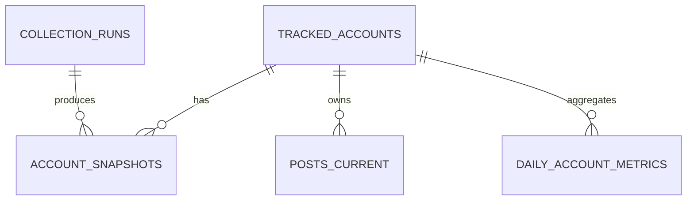
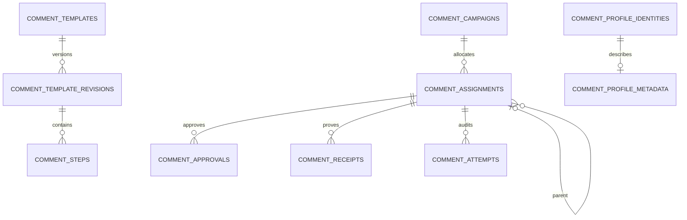

# 实体关系

## Execution V2

## Selector Probe

部分关系通过业务ID/JSON维护而非数据库FK，详见表目录。

## TikTok Stats

## Comment Campaign

Campaign通过`template_id + template_revision`锁定版本；Assignment通过`parent_assignment_id`形成实际执行树。

## 同名Account说明

Legacy SQLite `accounts`与可选MySQL ORM `accounts`不是同一Schema或自动同步关系；任何迁移都必须显式映射。
