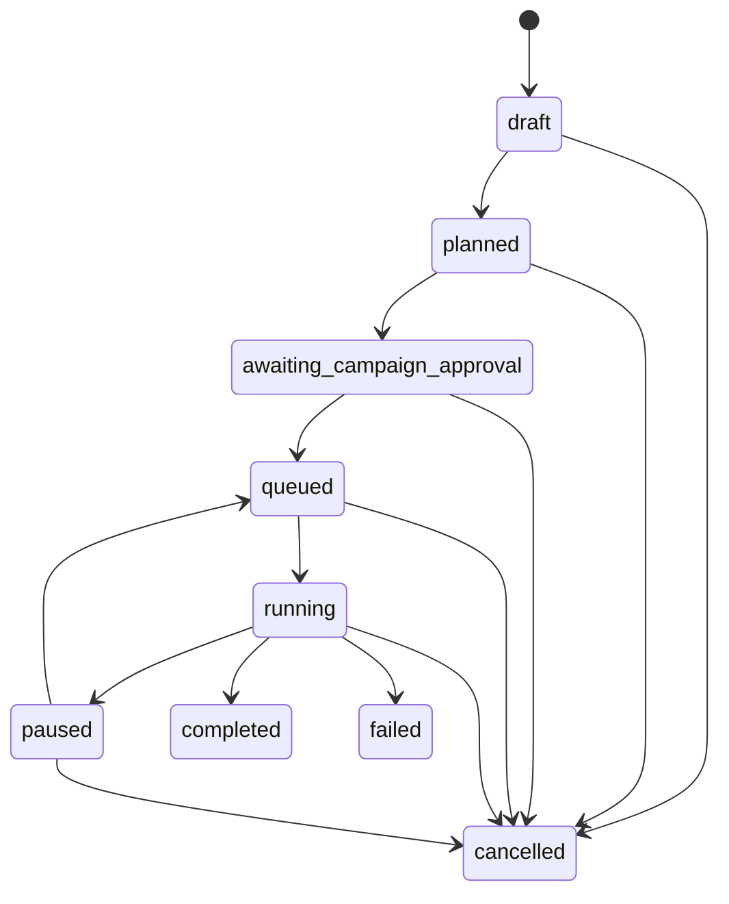

# Comment Campaign状态机

## Campaign

## Assignment
主路径：`planned|waiting_dependency → opening_profile → locating_video → locating_parent(threaded) → preparing_comment → awaiting_step_approval → submitting → verifying_receipt → published_verified|published_unverified`。

失败/暂停：准备阶段可到`failed|paused|paused_dependency`；父Receipt未验证时后代为`paused_dependency`。`published_unverified`只能人工确认verified或转paused/重新准备。终态为verified、failed、cancelled。

所有合法边见`comment_campaign/domain.py::CAMPAIGN_TRANSITIONS`和`ASSIGNMENT_TRANSITIONS`。状态更新必须携带revision；批准消费和提交CAS同时验证Campaign仍为running。
