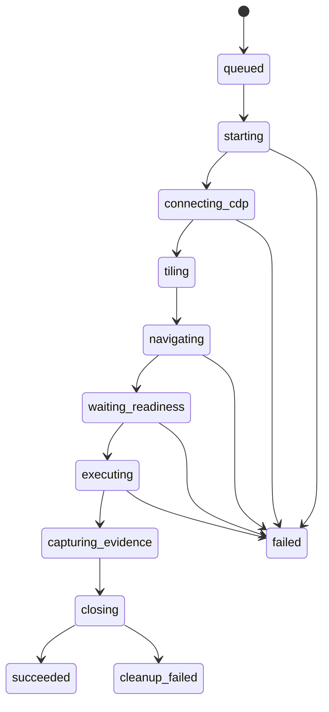

# Execution V2状态机

## Job
`queued → running → completed|cancelled|cleanup_blocked`。取消只阻止未开始工作；关闭失败进入`cleanup_blocked`而不能伪装完成。

## Profile

Stage枚举：`adspower_start`、`cdp_connect`、`window_tile`、`navigate`、`readiness`、`locate_element`、`execute_action`、`capture_evidence`、`adspower_stop`。来源：`execution_v2/models.py`、`scheduler.py`。
