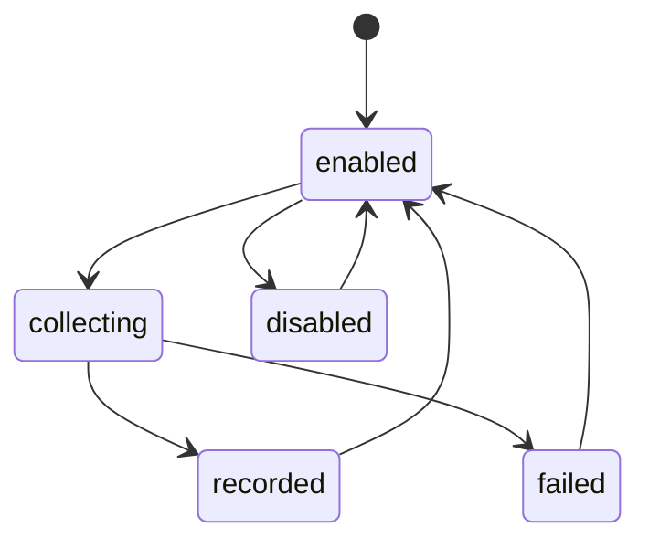

# TikTok Stats状态机

Tracked Account为enabled/disabled。Collection Run记录计划、运行和成功/部分失败/失败结果，具体值由Worker和Store写入。Worker Lease通过owner和expires获取、续期、释放；失去租约立即停止写入。

图用于解释采集过程，不对应单个集中enum。`该图为源码事实汇总；当前没有集中状态机实现。` 来源：`tiktok_stats/worker.py`、`store.py`、`queries.py`。
