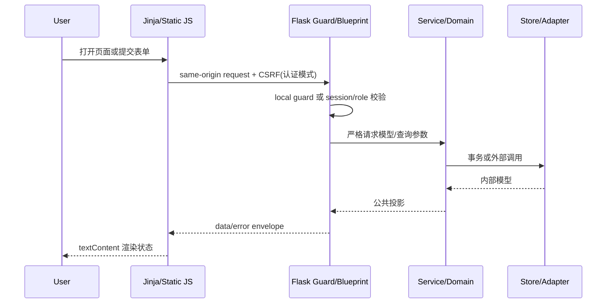
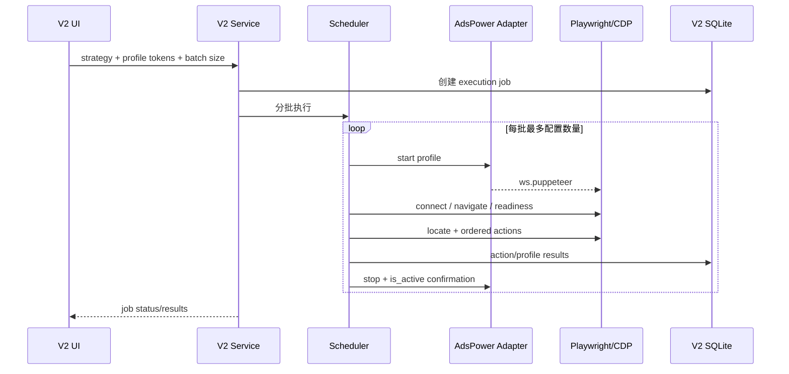
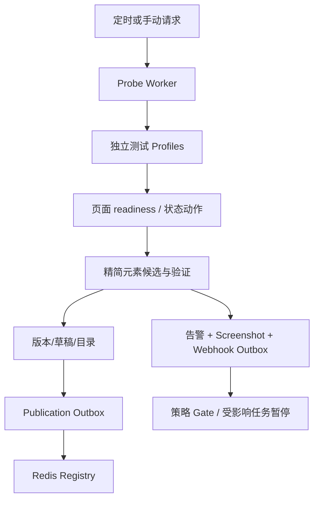
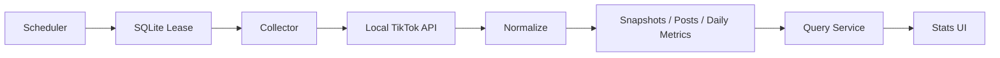
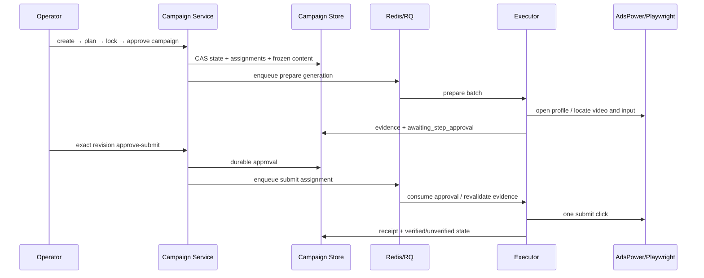

# 主要数据流

证据等级：`源码确认`、`测试确认`；本次未连接真实 AdsPower、TikTok、Redis、Buffer 或 R2，外部运行健康属于`运行时未验证`。

## 管理页面请求



当前旧接口不完全遵循统一 envelope；这些接口将在路由清单标记为 Legacy。

## Browser Execution V2



失败 Profile 记录并关闭，不应阻塞同批其他 Profile；未确认关闭时禁止下一批。

## Selector Probe



探针只允许导航、刷新、等待、有限滚动、打开/关闭评论面板等只读状态动作；禁止输入、提交、点赞、关注或账号修改。证据：`selector_probe/state_runner.py`。

## TikTok Stats



Cookie 由 Windows DPAPI 保护；API 不返回 Cookie 明文。

## Comment Campaign



线程模式只有父 Assignment 和父 Receipt 都为 verified，子步骤才可准备。提交后异常一律保守进入 `published_unverified`，不得自动重提。

## 配置流

环境变量覆盖持久化配置的范围因模块而异。通用形态为：

```text
显式测试注入
  → Flask config / Worker env
  → config.json 持久化设置
  → 代码默认值
```

具体优先级必须以各模块构造函数和 Worker 接线为准，不能假设所有配置统一。
