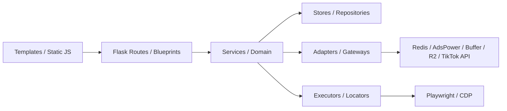

# 模块地图

## 顶层模块

| 模块 | 职责 | 主要入口 | 数据 | 状态 |
|---|---|---|---|---|
| Launcher | 本机依赖检查、进程启停、日志 | `launcher.py` | 环境变量、日志 | 已实现 |
| Gateway | Flask 装配、页面、旧 API、外部服务接线 | `gateway/app.py` | 多种 Store | 已实现 |
| Authentication | 登录、Session、CSRF、角色、审计 | `gateway/auth_*.py` | Management SQLite | 已实现 |
| Settings | 原子保存、备份、恢复、本机配置归一化 | `gateway/settings_store.py` | `config.json` | 已实现 |
| Accounts/Proxies | 账号、代理会话、Buffer 账号 | `gateway/account_store.py`、`gateway/proxy*.py` | SQLite/配置 | 已实现 |
| Content/Publish | 内容库、视频同步、Buffer/R2 发布 | `gateway/content_*`、`gateway/buffer_*` | 文件/外部 API | 已实现 |
| Legacy Browser | 旧元素、策略、浏览器动作和 agent | 根目录 `browser_*`、`browser/` | 配置/内存/日志 | Legacy |
| Execution V2 | 点选元素、策略、批次任务、执行结果 | `execution_v2/` | V2 SQLite | 工作区未提交 |
| Selector Probe | 页面探针、元素目录、版本、闸门、告警 | `selector_probe/` | Probe SQLite/Redis | 已实现且在调整 |
| TikTok Stats | 账号采集、快照、指标、趋势 | `tiktok_stats/` | Stats SQLite | 已实现 |
| Comment Campaign | 评论模板、分配、批准、提交、回执、恢复 | `comment_campaign/` | Campaign SQLite/RQ | 工作区未提交 |

证据：`源码确认`；Git 状态通过 `git status --short` 确认。

## 依赖方向

新模块应遵循该方向。当前 `gateway/app.py` 中存在路由直接处理业务和存储的 Legacy 例外。

## 关键复用关系

- Comment Campaign 复用 Execution V2 的 element store、AdsPower adapter、Playwright session 和 Locator 思路。
- Selector Probe 与 Execution V2 都处理元素，但目标不同：Probe 负责观测/目录/验证；V2 负责人工点选后的策略执行。
- Legacy Browser 和 V2 并存；新功能必须明确调用边界，禁止名称相同但数据模型混用。
- TikTok Stats 使用独立上游 API，不依赖 AdsPower 浏览器执行。
- Launcher 只监督进程，不承载业务状态。

## 逻辑中控

当前没有独立中控服务。中控职责由 `launcher.py`、`gateway/app.py`、`execution_v2/scheduler.py`、`comment_campaign/service.py`、各 Worker 与 Redis 共同承担。任何文档或新功能不得把它描述为已独立部署的服务。

## 模块修改影响

| 修改内容 | 至少检查 |
|---|---|
| 新页面 | Sidebar、Template、Static JS/CSS、权限、API、Node 测试 |
| 新 API | Blueprint、Schema、Service、错误码、OpenAPI、权限/CSRF 测试 |
| 新状态 | Domain 转换、Store CAS、UI 文案、恢复、状态机文档 |
| 新表 | DDL/Model、迁移、事务、备份、表结构文档 |
| 新 Worker job | Queue schema、幂等、租约、恢复、Topic 树 |
| 新浏览器动作 | Locator、readiness、副作用边界、Evidence、关闭确认 |
