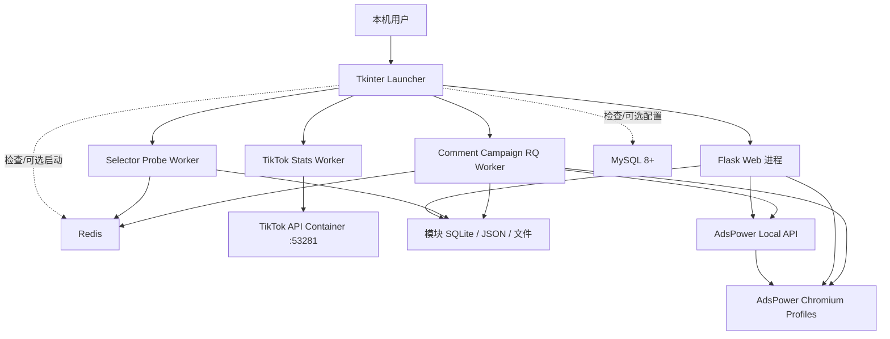

# 运行拓扑

## 进程图



证据：`源码确认`，进程监督类位于 `launcher.py`。

## 启动器监督对象

| 监督对象 | 实现 | 作用 |
|---|---|---|
| Flask | `FlaskServiceSupervisor` | 启动 Web 服务；启动前仅结束本项目旧 Flask |
| Comment Campaign | `CommentCampaignWorkerSupervisor` | 启动 `python -m comment_campaign.worker serve` |
| TikTok Stats | `StatisticsWorkerSupervisor` | 运行数据采集 Worker |
| Selector Probe | `SelectorProbeWorkerSupervisor` | 运行探针 Worker |

启动器还检查 Python/Node 依赖、Redis、可选 MySQL，并通过隐藏窗口和日志文件运行子进程。证据：`源码确认`，`launcher.py`。

## Flask 进程

`app.py` 只有创建应用的入口：

```python
from gateway.app import create_app
app = create_app()
```

`gateway.app.create_app()` 注册认证、Execution V2、Comment Campaign、TikTok Stats、Selector Probe 以及旧版页面/API。模块 Service 多采用 lazy factory，避免应用构造阶段连接 Redis、AdsPower 或数据库。

## 后台 Worker

### Selector Probe Worker

- 默认周期：30 秒检查一次。
- 负责定时探针、手动 run request、重试、告警、Webhook/Outbox 和 Redis 发布协调。
- 入口：`selector_probe.worker::serve`。
- 数据：Selector Probe SQLite、Redis、Evidence。

### TikTok Stats Worker

- 负责增量采集、校准、保留清理、租约续期。
- 入口：`tiktok_stats.worker::main`。
- 数据：TikTok Stats SQLite、DPAPI 加密 Cookie 文件。

### Comment Campaign Worker

- Windows 使用 RQ SpawnWorker。
- 启动时发布 owner-token 心跳、执行恢复协调，再消费 Campaign prepare/submit/reconcile job。
- 入口：`comment_campaign.worker::serve`。
- 数据：Comment Campaign SQLite、Execution V2 element store、Redis/RQ、Evidence。

## 外部服务

| 服务 | 当前使用方式 | 配置来源 |
|---|---|---|
| AdsPower | 本机 HTTP API，返回 CDP endpoint | `config.json` 或环境变量 |
| Redis | RQ、租约、心跳、Selector 发布 | 环境变量/探针设置 |
| MySQL | 旧根模型，可选 | `DATABASE_URL` 或启动器输入 |
| TikTok API | Docker Compose 绑定 `127.0.0.1:53281` | `services/tiktok_api/` |
| Buffer | GraphQL 发布 | 本机配置/账号数据 |
| R2 | 视频同步 | 本机配置 |

## 运行模式

### 本机直开

`LOCAL_DIRECT_MODE` 启用时不要求账号密码，但通过 loopback、Host 和请求来源约束拒绝远程访问。证据：`源码确认`、`测试确认`，见 `gateway/local_only.py`。

### 认证模式

使用 Flask Session、CSRF、管理员/操作员角色、登录失败锁定和会话过期。证据：`源码确认`，见 `gateway/auth_service.py`。

## 关闭顺序与失败原则

- 启动失败时，启动器应停止本轮已启动的全部服务。
- 浏览器批次必须先 stop 并用 `is_active` 确认关闭，再开始下一批。
- 无法确认关闭时，Profile 被隔离，Campaign 暂停，不能释放给另一任务立即复用。
- Worker 必须在 `finally` 中停止心跳并关闭 Store、Redis、Playwright 等资源。

证据：`源码确认`、`测试确认`，见 `execution_v2/scheduler.py`、`comment_campaign/profile_gateway.py`、`comment_campaign/worker.py`。
